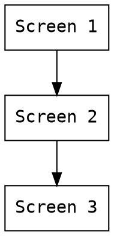

# EnergeCube_V01 M01
## 架構及硬體平台
- Repo: @haoyi-jason/EnergeCube_V01
- MCU: STM32H750
- LCD: 480x272, 電容式觸控, RGB888
- 通訊: CANBUS,UART
- 開發平台: STM32CUBE IDE, TouchGFX, FreeRTOS

## 目標及功能需求
- 建立篏入式顯示模組,功能需求為

### 畫面

#### Screen 1

- Screen 1
    - A,B,C,E,F,G 為按鈕元件
        - 每個按鈕由3個部份組成
            
            1. 圖示, 64x64 pixel ico
            2. 文字A
            3. 文字B
        - 每個按鈕需
            1. 建立對應"Click"處理函式
            2. 設定圖示函式
            3. 設定文字A函式
            4. 設定文字B函式
    - D區
        - 
        -由文字A, 文字B, 文字C, 圖示A組成
        -需建立文字A,B,C 的設定函式
        -需建立圖示A的設定函式
    - 按下"G"切換至Screen 2
- Screen 2: 日誌
    - 提供一個表格顯示系統日誌,並以CSV格式記錄.
    - 日誌記錄容量1000筆, 儲存至內部EMMC優先.
    - 提供刪除及滙出至SD卡功能.
    - 提供返回 Screen 1功能
- Screen 3: 設定
    - 提供系統參數設定功能,建立DF_及LD_參數表, 參數內容由使用者定義
    - 提供系統重置功能.
    - 提供時間校準功能
- 

### 預期結果

- 上電後顯示Screen 1
- Screen 1上的按鈕及文字具備感知及設定API
- Screen 2具備日誌功能, 並以EMMC為儲存媒體

